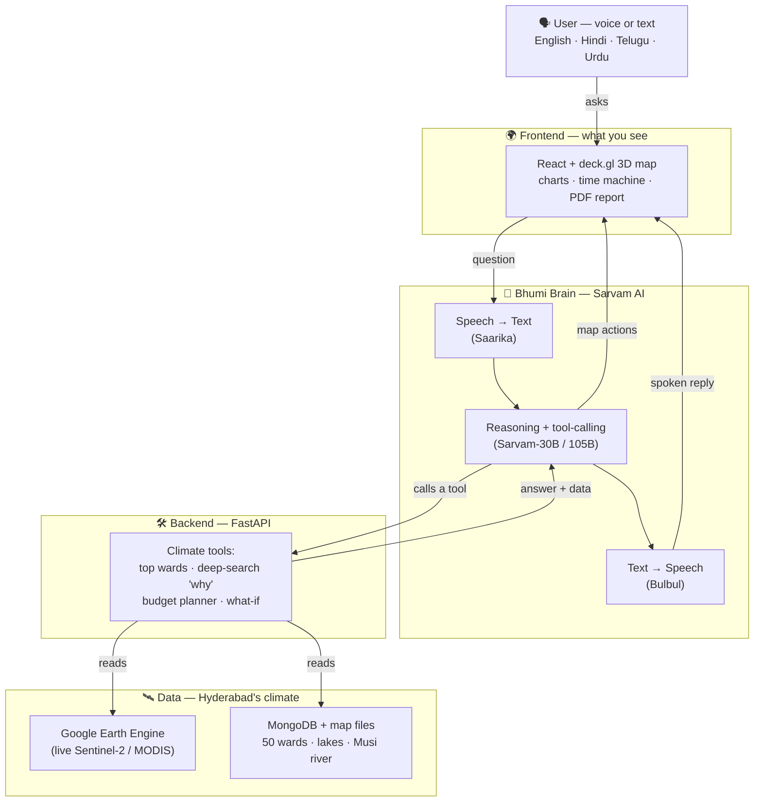

# How Bhumi Works — Architecture (for everyone)

Bhumi is a **climate co-pilot for Hyderabad**. You talk to it in your own language, and it shows you the city's climate risk on a map, explains the *why*, plans a budget, and hands you a report.

---

## 🧭 The simple picture

```
                         🗣️  YOU
              ask in English · हिंदी · తెలుగు · اردو
                     (by voice or by typing)
                              │
                              ▼
        ╔═════════════════════════════════════════════╗
        ║        🌍  BHUMI DASHBOARD (what you see)    ║
        ║   a living 3D map of Hyderabad's wards       ║
        ║   • risk colours  • time slider 2016→2026    ║
        ║   • charts        • action report (PDF)      ║
        ╚═════════════════════════════════════════════╝
                              │  your question
                              ▼
        ╔═════════════════════════════════════════════╗
        ║         🧠  BHUMI'S BRAIN  (Sarvam AI)       ║
        ║   1. LISTENS  — turns your voice into text   ║
        ║   2. THINKS   — decides what to look up      ║
        ║   3. SPEAKS   — replies in your language     ║
        ╚═════════════════════════════════════════════╝
                              │  "go find this for me"
                              ▼
        ╔═════════════════════════════════════════════╗
        ║         🛠️  THE TOOLBOX  (skills)            ║
        ║   • which wards are worst?                   ║
        ║   • why is this ward at risk?  (with sources)║
        ║   • where should ₹10 crore go?               ║
        ║   • what if we add more trees?               ║
        ╚═════════════════════════════════════════════╝
                              │  needs real numbers
                              ▼
        ╔═════════════════════════════════════════════╗
        ║         🛰️  THE DATA  (Hyderabad's climate)  ║
        ║   • Satellite imagery (Google Earth Engine)  ║
        ║   • 50 real wards · lakes · the Musi river   ║
        ║   • 2016 → 2026 history + a short forecast    ║
        ╚═════════════════════════════════════════════╝
```

**Read it top-to-bottom:** you ask → the dashboard passes it to the AI brain → the brain picks the right tool → the tool reads real Hyderabad data → the answer flows back up as a map change + a spoken reply.

---

## 🎬 What happens in one question (example)

> You say (in Telugu): *"Which areas flood the worst, and why?"*

```
  🎤 voice ──► 🧠 "they want flood hotspots + the reason"
                  │
                  ├─► 🛠️ find worst flood wards   ──► 🛰️ Malakpet, Nagole, Saidabad
                  └─► 🛠️ find the causes          ──► 🛰️ low-lying Musi belt, blocked drains
                  │                                      (with real report citations)
                  ▼
  🌍 map lights up those wards  +  🔊 Bhumi answers back in Telugu
```

Everything you hear is also something you **see** on the map — the AI doesn't just talk, it *acts*.

---

## 🧩 The four-step journey (the product in one line)

```
   👀 SEE  ───►  💬 ASK  ───►  🗺️ PLAN  ───►  📄 JUSTIFY
  the map      a question     a budget       a report
  of risk      in your        that does      the council
               language       the most good  can act on
```

---

## 🛠️ Same picture, with the tech names (for builders)



---

## ✅ What's real vs. modeled (honest version)

| Part | Status |
|---|---|
| Voice, reasoning, spoken reply (Sarvam AI) | 🟢 **Real**, end-to-end |
| Vegetation from satellite (Google Earth Engine) | 🟢 **Live** Sentinel-2 |
| Ward map, lakes, Musi river | 🟢 **Real** geography |
| "Why" causes + their sources | 🟢 **Real** reports cited |
| Heat & flood risk scores | 🟡 **Modeled**, calibrated to real flood/heat reports — satellite-ready |
| Population & cost estimates | 🟡 **Modeled** first-order estimates |

**One-line summary:** the *intelligence* is fully real Sarvam AI; the *data* is satellite-backed where it counts and honestly modeled-but-calibrated everywhere else.
