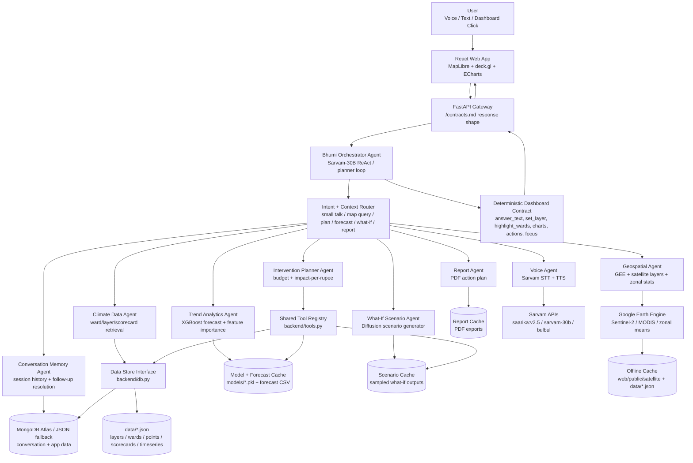
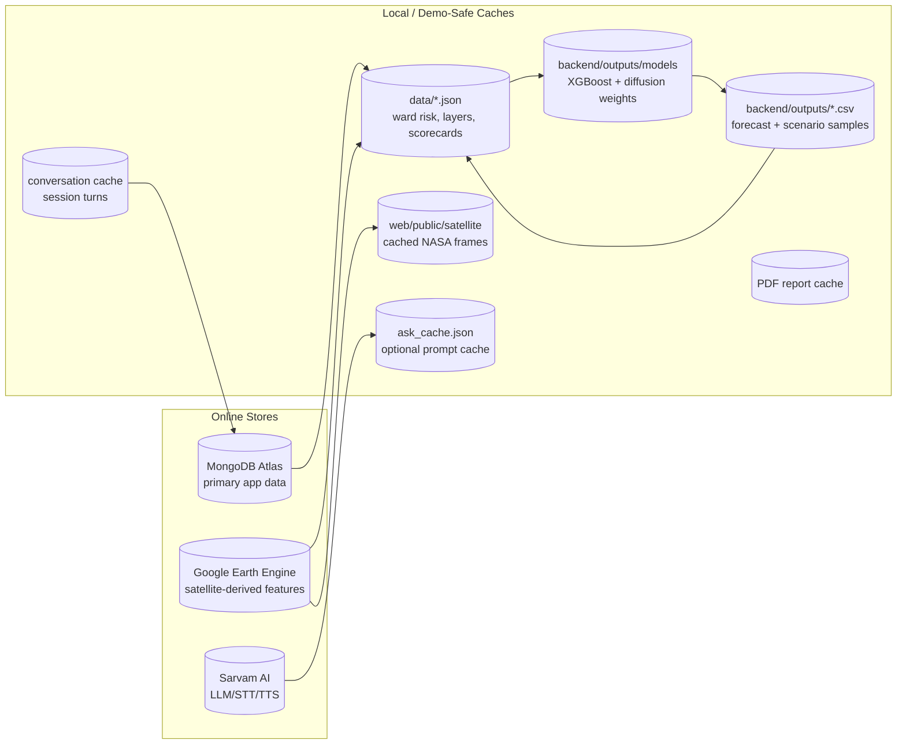
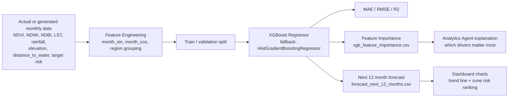
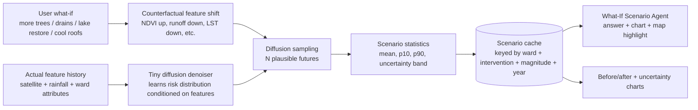
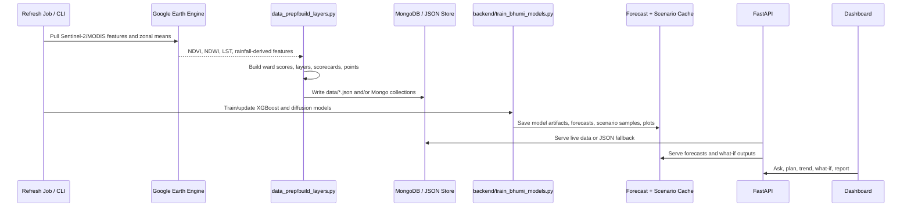

# Bhumi Multi-Agentic System Architecture

This diagram shows the target system structure for Bhumi: a climate digital twin where multiple agents share one tool registry, one data layer, model outputs, and cached artifacts.

## 1. Multi-Agent System

## 2. Database And Cache Layers

Caching rule: every expensive or failure-prone path should write a local artifact. The dashboard should still run from `data/*.json`, `web/public/satellite/`, cached model outputs, and JSON fallback when network services are unavailable.

## 3. Tool Structure

```mermaid
flowchart TB
  Tools["backend/tools.py\nOpenAI-style function tools + MCP tools"]

  Tools --> ReadTools["Read Tools"]
  ReadTools --> GetLayer["get_layer(layer, year)"]
  ReadTools --> WardStats["get_ward_stats(layer, year)"]
  ReadTools --> TopRisk["top_risk_wards(layer, n, year)"]
  ReadTools --> Scorecards["get_scorecards(year)"]
  ReadTools --> Compare["compare_years(layer, y1, y2)"]
  ReadTools --> Trend["risk_trend(layer)"]
  ReadTools --> Explain["explain_risk(layer)"]

  Tools --> ActionTools["Action Tools"]
  ActionTools --> Recommend["recommend_actions(layer, wards)"]
  ActionTools --> Simulate["simulate_intervention(ward, intervention, magnitude, year)"]
  ActionTools --> Plan["plan_interventions(layer, intervention, budget, year)"]
  ActionTools --> Population["ward_population(name)"]

  Tools --> ExternalTools["External / Interface Tools"]
  ExternalTools --> MCP["backend/mcp_server.py\nsame tools for MCP clients"]
  ExternalTools --> GEE["backend/gee.py\nsatellite feature extraction"]
  ExternalTools --> Sarvam["backend/sarvam.py\nchat/STT/TTS"]
  ExternalTools --> Report["backend/report.py\nPDF generation"]
```

## 4. XGBoost Trend Analytics Pipeline

Recommended production role:
- `risk_trend(layer)` should first read cached XGBoost forecasts if present.
- If cache is stale or missing, run `backend/train_bhumi_models.py` on the latest actual feature CSV.
- Store model artifact, metrics, feature importance, and forecast CSV.
- Return city-level trend plus ward/zone-level ranking to the agent.

## 5. Diffusion What-If Scenario Pipeline

Recommended production role:
- Use XGBoost for calibrated point forecasts.
- Use diffusion for plausible distributions and uncertainty under interventions.
- Cache scenario outputs because diffusion sampling is slower and repeated demos ask the same what-if questions.

## 6. Actual Data Generation And Refresh

## 7. Agent Responsibilities

| Agent | Responsibility | Primary Tools / Data |
|---|---|---|
| Orchestrator Agent | Decides whether to answer casually, call tools, plan, forecast, simulate, or report | `backend/agent.py`, Sarvam `sarvam-30b` |
| Memory Agent | Keeps follow-up context and active ward/layer/session state | `backend/conversation.py`, Mongo/JSON fallback |
| Climate Data Agent | Reads current and historical risk layers | `get_layer`, `get_ward_stats`, `top_risk_wards`, `get_scorecards` |
| Geospatial Agent | Builds satellite-derived features and map layers | `backend/gee.py`, `data_prep/build_layers.py` |
| Trend Analytics Agent | Forecasts future risk and explains drivers | XGBoost model, `risk_trend`, feature importance |
| Scenario Agent | Generates plausible intervention futures | diffusion denoiser, `simulate_intervention`, scenario cache |
| Planner Agent | Optimizes intervention budget by impact-per-rupee | `plan_interventions`, `ward_population` |
| Voice Agent | Handles multilingual STT/TTS | Sarvam `saarika:v2.5`, `bulbul` |
| Report Agent | Produces council-ready action reports | `backend/report.py` |
| MCP Agent Interface | Exposes the same tools to external agents | `backend/mcp_server.py` |

## 8. Implementation Hooks To Add Next

The repo already has `backend/train_bhumi_models.py` and plot outputs. To wire the ML stack into the live agent, add:

1. `backend/ml_cache.py`
   - Reads/writes forecast CSVs, feature importance, diffusion samples, model metadata.
   - Cache key: `dataset_hash + target + layer + ward + intervention + magnitude`.

2. `backend/analytics.py`
   - `forecast_trend(layer, horizon_months=12)`.
   - Uses cached XGBoost forecast or triggers retraining.

3. `backend/scenarios.py`
   - `generate_what_if(ward, intervention, magnitude, n_samples=50)`.
   - Uses diffusion cache first, then samples and saves.

4. Tool registry additions in `backend/tools.py`
   - `xgboost_trend(layer, horizon_months)`.
   - `diffusion_what_if(ward, intervention, magnitude)`.
   - Keep existing `risk_trend` and `simulate_intervention` as fast fallbacks.

5. API endpoints in `backend/main.py`
   - `GET /analytics/trend?layer=flood`.
   - `POST /scenario/what-if`.
   - `GET /analytics/cache/status`.

